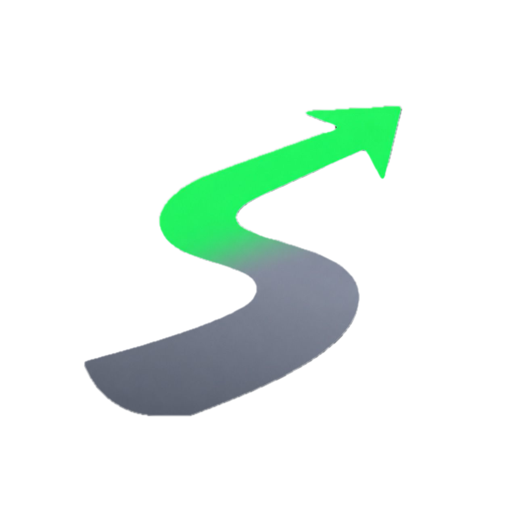

# StartFocus

<p align="center">
  
</p>

<p align="center">
  App mobile de produtividade desenvolvido com Flutter para ajudar o usuário a entrar em estado de foco com modos de sessão prontos, cronômetro livre e uma interface pensada para uso rápido no dia a dia.
</p>

<p align="center">
  
  
  
</p>

---

## Sobre o projeto

O **StartFocus** foi criado como um projeto de estudo e portfólio com foco em desenvolvimento mobile, organização de interface e modelagem de regras de negócio para gestão de tempo.

Em vez de ser apenas um cronômetro simples, o app oferece diferentes estratégias de foco para contextos distintos de trabalho e estudo, como sessões curtas no estilo Pomodoro, blocos mais longos de trabalho profundo e um modo livre para acompanhar o tempo sem pausas automáticas.

Esse projeto demonstra na prática:

- construção de interfaces com Flutter e Material 3
- componentização de widgets reutilizáveis
- navegação entre telas com rotas nomeadas
- gerenciamento de estado local com `ChangeNotifier`
- modelagem de timers, pausas e ciclos de produtividade
- separação entre camada visual, tema e regras de negócio

---

## Funcionalidades atuais

### Modos de foco

- **Iniciante**: Pomodoro clássico `25 / 5`
- **Produtivista**: regra `52 / 17`
- **Deep Work**: sessões longas `90 / 30`
- **Livre**: cronômetro contínuo sem pausas automáticas

### Experiência do usuário

- seleção de modo na tela inicial
- exibição destacada do tempo em andamento
- botão único para iniciar, pausar e continuar
- reinício rápido da sessão
- ação para pular o ciclo atual
- indicador da fase atual e da próxima fase
- contador de progresso da sessão total
- interface escura com identidade visual própria

---

## Arquitetura do projeto

O projeto segue uma organização simples e escalável, inspirada em uma separação entre interface e regra de negócio:

```bash
lib/
├── app/
│   ├── app.dart
│   ├── theme/
│   ├── view/
│   │   ├── home/
│   │   └── pages/
│   ├── view_model/
│   └── widgets/
└── main.dart
```

### Responsabilidades

- `view/`: páginas e composição visual das telas
- `widgets/`: componentes reutilizáveis, como cabeçalhos e timers
- `view_model/`: controle de estado e regras dos cronômetros
- `theme/`: paleta, tipografia e identidade visual do app

Hoje o gerenciamento de estado é feito com `ChangeNotifier`, o que mantém o projeto leve e didático. Em uma evolução futura, ele pode migrar com facilidade para soluções como Provider, Riverpod ou Bloc, dependendo da complexidade desejada.

---

## Tecnologias utilizadas

- Flutter
- Dart
- Material 3
- `ChangeNotifier` para estado local
- `Timer` da biblioteca padrão do Dart para regras de tempo

---

## Regras de negócio implementadas

O app já possui uma camada de comportamento que vai além da interface:

- alternância entre foco e pausa
- limite de ciclos por sessão
- retomada de sessão pausada
- reinício completo da contagem
- encerramento da sessão ao atingir o número máximo de ciclos
- cronômetro livre com contagem contínua

---

## Como rodar o projeto

```bash
# Clone o repositório
git clone https://github.com/DaviMadruga/start-focus-flutter-app.git

# Entre na pasta do projeto
cd start-focus-flutter-app

# Instale as dependências
flutter pub get

# Execute no dispositivo ou emulador
flutter run
```

### Requisitos

- Flutter SDK instalado
- Dart SDK compatível com o Flutter da sua máquina
- emulador Android, simulador iOS ou dispositivo físico

---

## Próximos passos

As próximas evoluções pensadas para o projeto são:

- persistência local das sessões e preferências
- notificações para início e fim de ciclos
- testes unitários para os `view_models`
- refinamento de responsividade e acessibilidade
- métricas de uso e histórico de foco

---

## O que este projeto comunica no portfólio

O StartFocus mostra minha capacidade de transformar uma ideia de produto em uma aplicação funcional, com preocupação tanto na experiência do usuário quanto na organização interna do código. É um projeto que reforça fundamentos importantes de desenvolvimento mobile: composição de UI, gerenciamento de estado, modelagem de lógica temporal e evolução incremental de arquitetura.

---

## Autor

**Davi Madruga Cavalcanti**
